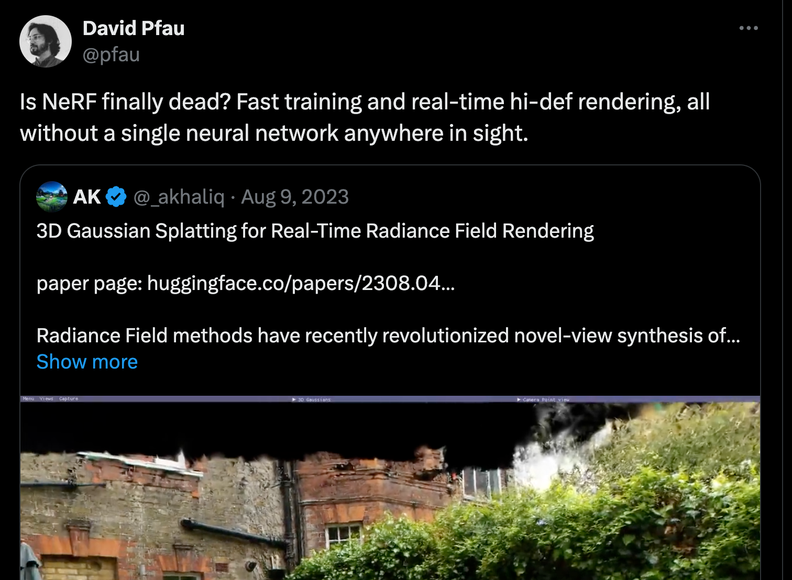

## 3D Scene Representation
Representing a 3D scene

generating 3D content, which can be applied toward virtual endeavors like animation, video games, VR/AR ([spatial computing](https://tinyurl.com/zky5tk3x) if you're cool) or brought into the world through 3D printing and AI-powered manufacturing. 

I'll mainly rely on 3D reconstruction as a motivating example since this post is about NeRFs and 3D reconstruction happens to be the canonical task for NeRFs that spurred their development. Regardless, it's not the specific application that matters here as much as the underlying idea which is how to find a fast, flexible, and efficient method for representing data that lives in 3 dimensions.

_implicit approach_

A commensense way of representing 3D content would be to discretize the content into a 3-dimensional grid. Here, each [voxel](https://en.wikipedia.org/wiki/Voxel) would store four values: The RGB color value for this region as well as the opacity at this point. With just these four numbers, we can 

For reference, this a $128 \times 128$ rendition of a well-known painting:

## Implicit Shape Representation

From [Wikipedia](https://en.wikipedia.org/wiki/Vector_field): "In vector calculus and physics, a **vector field** is an assignment of a vector to each point in a space, most commonly Euclidean space $\mathbb{R}^n$"

(Add in a point motivating the angle)

![nerf_network.png]

## Spatial Encoding

This can be a bit tricky to understand so I'll try to give you a close look at the mathematical definitions along with some intuition in case the math doesn't make sense.

$\alpha(x) = [\cos(2^l \bf{x}),\sin(2^l\bf{x}) ]_{l=0}^{L=1}$

So when we say that the NeRF's MLP takes 3D coordinates as input, what we really mean is that the positional embeddings of these coordinates are concatenated together with the viewing angle and fed into the MLP's input layer.

Nowadays many applications use a slightly more sophisticated form of spatial embedding introduced in the [Mip-NeRF](https://jonbarron.info/mipnerf/) paper or use a clever data structure to store explicit embeddings like in NVIDIA's [Instant-NGP](https://github.com/NVlabs/instant-ngp)

## Rendering an Image with NeRFs

We have $r_{\theta}$ and $c_{\theta}$ and 

As we discussed, this would require an infeasible amount of storage

The beauty of NeRFs is that they avoid computing the color at each point in 3D space.

For simplicity, let's avoid thinking about rendering an entire image and just focus on how to capture a single pixel. To do this, you can build a mental picture of what goes in your camera to capture a pixel's worth of color when you point it at an object and click the button. Put plainly, your camera emits a ray of light from the pixel location which retrieves the pixel value. This ray shoots forward in a straight line toward the object until it makes contact with its surface. The pixel color is then determined by the RGB value at this infinitesimal point of contact.

To imbue this intuition with some mathematical rigor, we can define ourray as a function of time $\bf{r}(t)$ that outputs locations in 3D space. When viewing a scence from a given angle, it's trivial to trace this ray's linear trip through space. Using our NeRF parameters also allows us compute the color $c_{\theta}(\bf{r}(t))$ and opacity $\sigma_{\theta}(\bf{r}(t))$ that our ray will encounter at any time value.

These are all the components required for us to get a formula to compute the actual pixel value from a ray that is shot through our NeRF scene.

$$ C(r,\theta) = \int_{t_n}^{t_f} T(\bf{r},t)\sigma_{\theta}(\bf{r}(t))c_{\theta}(\bf{r}(t))\it{dt}$$

$$ T(t) = \exp(-\int_{t_n}^{t}\sigma_{\theta}(\bf{r}(s))\it{ds})$$

## Training A NeRF

Okay last piece of the puzzle: You have a 3D scene which is represented (perhaps very poorly) by a neural network and you are capable of rendering its scence representation into image space. So now how do you get a tractable and differentiable loss function which will allow you to optimize your neural network and get it to *correctly* represent the 3D scene?

## Some Remarks

so impressive in fact that it's led some to question whether NeRFs as a whole are facing extinction

I've mostly stuck to the NeRF formulation introduced in the original NeRF paper by Mildenhall et al. I've also included some notes about architectural changes introduced in later works where relevant but really most of the key building blocks were introduced in that work.

What's remarkable is that that Mildenhall paper was in 2020 meaning that NeRFs themselves are only 4 years old. 
